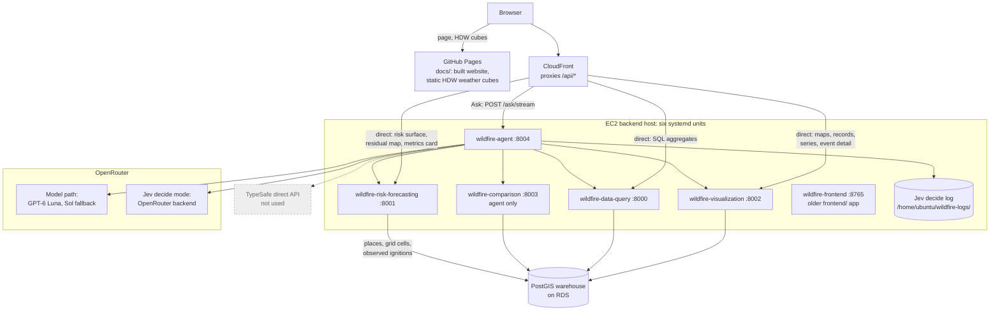
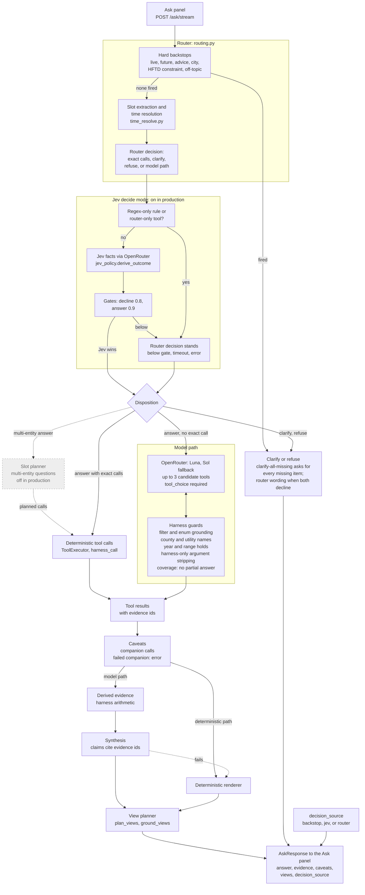
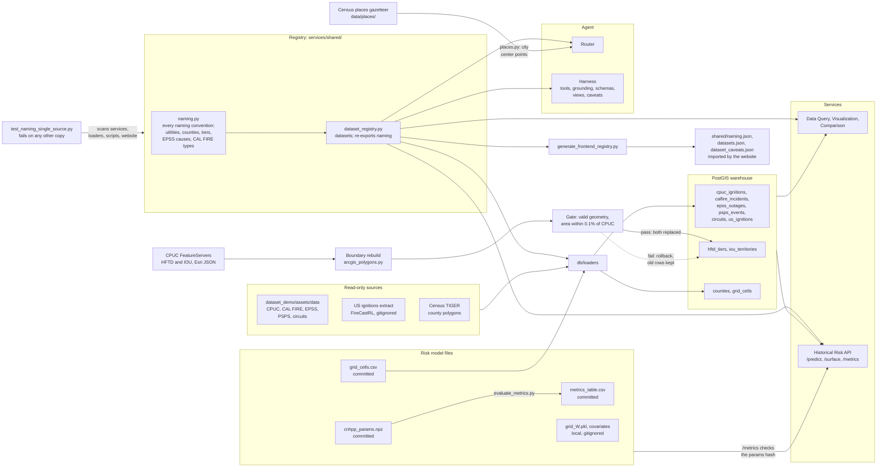

# Wildfire Platform

A wildfire research platform combining an interactive analysis website, a PostGIS event warehouse, modular FastAPI services, and a historical **cNHPP** (convolutional non-homogeneous Poisson process) ignition-risk model. The website supports recorded fire and outage exploration, weather playback, modeled risk and residual maps, regional and seasonal analysis, and result exports.

The current website offers **19 analysis views in five panel categories**, and the Ask panel can open all 19 from a chat answer. Opening the website does not fit a model or require a local database.

## Architecture

Three diagrams: where things run, what the agent does with one question, and where the data comes from. Grey dashed boxes and dashed lines are switched off or unused in production. Production facts come from [`docs/HANDOFF_SINCE_PR4.md`](docs/HANDOFF_SINCE_PR4.md) sections 12 and 13; everything else is what the code on `main` does.

### 1. System and deployment



The website calls the Visualization API for maps and records, the Data Query API for grouped counts, summaries and regional series, and the Historical Risk API for the risk surface (`/surface`), the residual map (`/observed-training`) and the model performance card (`/metrics`), all through CloudFront (`website/src/api.ts`, `website/.env.production`). The browser never calls the Comparison API; only the agent does. HDW playback loads the static cubes from Pages. `wildfire-frontend` serves the older `frontend/` app, not the Pages site. TypeSafe's direct API is still the code default for `AGENT_JEV_BACKEND`, but production runs Jev through OpenRouter.

### 2. The life of a question inside the agent



`AgentOrchestrator.ask` (`services/agent/orchestrator.py`) runs the router, then decide (`decisions/decide_mode.py`), then the slot planner (`eval/slot_plan.py`, only on `multi_entity_deferred` and only when `AGENT_SLOT_PLAN` is on), then computes `decision_source` (`decisions/provenance.py`) on the final route. Jev shadow mode (`decisions/shadow.py`) is the alternative to decide and is not running: `AGENT_JEV_MODE` holds one value. The guards live in `grounding.py`, `tools.py`, `time_resolve.py` and `schemas.py`; caveats and companion calls in `caveats.py`; harness arithmetic in `derived.py`; clarify-all-missing in `clarify_missing.py`; views in `views.py`. Derived evidence is added only before synthesis, so only on the model path. The SSE stream carries harness events only, never model prose (`streaming.py`).

### 3. Data



`db/loaders/load_all.py` loads every table; the boundary pair comes from `load_boundaries.py` behind the gate and keeps its old rows if the gate fails (`python -m db.loaders.rebuild_boundaries` reloads only that pair). CPUC ignitions get their `county` at load by point-in-polygon against `wildfire.counties`. Every naming convention (utility codes and spellings, the 58 county names and aliases, HFTD tier names, EPSS cause codes, the CAL FIRE default incident types, and the question patterns built from them) is defined once in `services/shared/naming.py`. `dataset_registry.py` defines the datasets and re-exports every name in `naming.py`, and callers import from the registry: the three query services (through `services/data_query/filters.py` and their own queries), the risk service (`place.py`), the router (`routing.py`), the harness (`grounding.py`, `tools.py`, `argument_normalize.py`, `schemas.py`, `views.py`, `caveats.py`, `clarify_missing.py`, the Jev modules), and the loaders (`util.py`, `arcgis_polygons.py`, `load_iou.py`, `load_epss.py`). `counties.py`, `epss_causes.py` and `calfire_county.py` apply those names rather than defining their own. `scripts/generate_frontend_registry.py` writes `shared/naming.json`, `shared/datasets.json` and `shared/dataset_caveats.json`, which the website imports (`website/src/data.ts`, `website/src/caveats.ts`); `tests/test_frontend_registry_generated.py` fails when they are stale. `tests/test_naming_single_source.py` fails if any other module, loader, script, or website source file defines its own list of those names (`services/shared/README.md` has the full scope). `GET /metrics` returns 503 unless the stored table matches the committed parameters.

The default website connects to the deployed APIs configured in [`website/src/api.ts`](website/src/api.ts). Local services are useful for backend development but are not prerequisites for previewing the built website.

## Layout

```text
website/                        # production React/TypeScript source and Node tests
  src/panelViews.ts             # available analysis views and their default settings
  src/api.ts                    # browser-facing API URLs, pagination and SSE client
  scripts/build.mjs             # Vite build into docs/; cleans temporary output
docs/                           # built GitHub Pages entrypoint and static assets
frontend/                       # separate local Historical Map + Planning Tool
analysis/                       # audits and comparison notes
shared/                         # cross-service utilities (paths, db)
db/                             # PostGIS schema + loaders (map layers + risk grid)
tests/                          # live API verification suite
services/data_query/            # read API over warehouse tables
services/visualization/         # styled GeoJSON / time series / detail
services/comparison/            # cross-utility / region / period metrics
services/agent/                 # deterministic router, model harness, caveats, view planner
  decisions/                    # optional Jev (TypeSafe) decision layer, off by default
  eval/                         # eval cases, holdouts, runners, and stored run outputs
services/risk_forecasting/
  models.py                     # HPP / NHPP / cNHPP (do not modify lightly)
  grid_data_prep.py             # grid data loaders (do not modify lightly)
  adjacency.py                  # rebuild W from grid_cells.csv
  fit_model.py                  # fit + persist xi/beta
  predictor.py                  # trailing-window scoring
  app.py                        # FastAPI service
  data/                         # local data (large files gitignored)
  artifacts/                    # committed cnhpp_params.npz; replaced by an intended fit
  legacy/                       # superseded circuit-level code (reference only)
```

## Quick start: current website

To preview the committed website, run this from the repository root:

```sh
python -B -m http.server 8770 --bind 127.0.0.1 --directory docs
```

Open **http://127.0.0.1:8770/**. This serves the built application; no npm installation is needed for this path. Recorded-event panels need network access to the deployed APIs, and the basemap loads separately from OpenStreetMap.

For frontend development, use **Node.js 24** and run:

```sh
cd website
npm ci
npm run dev
```

Open **http://127.0.0.1:8771/**. Validate and rebuild from `website/` with:

```sh
npm test
npm run build
```

The build updates `docs/index.html` and `docs/assets/workspace/`. Commit the website source and generated output together. Other static assets are retained, and temporary build files are removed automatically. See the [website guide](website/README.md) and [Pages guide](docs/README.md).

### Using the workspace

1. Click **Add panel**, choose a category, then select an analysis view. It opens with suitable defaults; additional copies can be created with **Duplicate**.
2. Set the data source and open **Filters** to choose the scope. Each panel keeps its own settings.
3. Use **Change view** in a Map, Time series or Comparison header to switch its analysis while keeping the panel position, custom name and filters.
4. Hover or focus a map event for its location context. Click to keep the bubble open, then choose **View details**. Clusters expand to their member events.
5. Expand a panel for more space. The expanded **X** or **Escape** returns to overview; the overview X removes the panel. Overview scrolling moves the page.
6. Use the header export menu for CSV or supported chart PNG downloads. Exports include the complete filtered result, including regions or rows outside the overview.

| Category | Current views |
|---|---|
| Map | Wildfire events, Outage circuits, PSPS areas, Fire weather, Modeled ignition risk surface, Model residual map |
| Time series | Event trends, Year comparison, Regional trends, Seasonal profile, Cumulative acres burned within a season, Customers affected over time |
| Comparison | County ranking, Utility comparison, Cause breakdown |
| Record table | Event records |
| Stat card | Summary metrics, Medical baseline and life support customers affected by EPSS outages |

The views are defined in [`website/src/panelViews.ts`](website/src/panelViews.ts).

- **Workspace year:** a global year bar sets the year for every panel; a panel can pin its own year instead, and a badge marks the override.
- **Event map playback:** event maps can step day by day through the selected period.
- **Risk surface and residual map:** the risk surface maps the cNHPP hindcast for one historical date. The residual map compares observed CPUC ignitions with that hindcast using the training cell assignment. Both are statistical hindcasts, not forecasts.
- **Dataset notes:** panel headers show the dataset caveats (for example EPSS is PG&E-only and PSPS totals are customer-events).
- **Theme:** a light and dark theme toggle.

**Seasonal profile:** select one to five years inside Filters. A single year is a solid weekly-count line; multiple years have dashed individual lines and a thicker solid average. The collapsed filter shows the number of selected years. **Regional trends:** PG&E divisions share the same vertical scale, with all regions available in expanded view and exports.

Panel names, order and settings are saved in browser local storage. Chat messages and fetched records are not persisted. Ask uses the existing SSE agent endpoint; a model outage does not prevent direct use of the data panels.

### Data interpretation and current scope

[db/schema.sql](db/schema.sql) is the schema reference. EPSS is PG&E-only, and its cause categories describe outages. CPUC and CAL FIRE records do not supply the same cause field. PSPS customer totals count customer-events, not distinct households.

Current rankings compare recorded counts, not modeled circuit risk or rates normalized by customers served. HDW playback is a supplied historical weather surface, not predicted ignition probability. The risk surface and residual map are historical hindcasts for dates with covariate files. A model performance card is not a workspace view yet; the risk API exposes the metrics at `GET /metrics`. Source date ranges reflect recorded events rather than verified collection completeness or last-scrape timestamps.

### Connecting the website to local APIs

Copy `website/.env.example` to `website/.env.development.local`, or set these public URLs
in the frontend build environment:

```dotenv
VITE_VISUALIZATION_URL=http://127.0.0.1:8002
VITE_AGENT_URL=http://127.0.0.1:8004
VITE_DATA_QUERY_URL=http://127.0.0.1:8000
VITE_RISK_URL=http://127.0.0.1:8001
```

Restart the development server or rebuild the website afterward. The checked-in
development and production profiles enable SQL aggregation at
`https://d3t70p3if3twy3.cloudfront.net/api/data-query`. The repository-root `.env` configures Python
services. The older `frontend/assets/js/api-config.js` belongs to the separate local UI.

**Aggregation rollout:** `/grouped-counts`, `/summary` and `/regional-series` are
enabled in both build profiles. Their CloudFront routing, query parameters, CORS
and response contracts were verified against the live HTTPS service after the
production routing fix. A configured service failure remains visible; it does not
switch to browser calculations. Set `VITE_DATA_QUERY_URL=` in the build environment
to explicitly use the Visualization API's complete-record aggregation path instead.
See the [API guide](services/data_query/README.md).

## Local backend setup

Install the Python dependencies in a virtual environment:

```bash
python -m venv .venv
# Activate it: .venv\Scripts\Activate.ps1 (PowerShell) or source .venv/bin/activate (POSIX)
pip install -r requirements.txt
```

The research plots in `services/risk_forecasting/analysis.py` also need `pip install -r requirements-analysis.txt` (matplotlib, geopandas); nothing else does.

Create `.env` from [`.env.example`](.env.example) on first setup, then review its database and data-directory settings. On Windows, set these in each service terminal when needed:

```powershell
$env:PYTHONPATH = "."
$env:PYTHONIOENCODING = "utf-8"
```

Run each API in a separate terminal from the repository root. These are the local development ports:

| Component | Port | Role |
|---|---|---|
| Data Query | 8000 | Filtered warehouse records, spatial queries and rankings |
| Historical Risk | 8001 | Fitted historical place/date ignition scoring |
| Visualization | 8002 | GeoJSON layers, time series, territory and event detail |
| Comparison | 8003 | Backend utility, region and period comparisons |
| Agent | 8004 | Deterministic/model routing and SSE answers |
| PostGIS | 5433 | Local database host port; container port is 5432 |

The current website's direct data panels need Visualization and its warehouse; SQL aggregation additionally requires the updated Data Query service. Ask uses Agent and the relevant downstream services. The risk surface and residual map panels need the Historical Risk API. Historical scoring additionally requires the model input files described below.

### PostGIS warehouse (map layers + grid)

See [`db/README.md`](db/README.md). Docker Compose starts the database only, on host port **5433**. For a fresh local development warehouse, start it and wait for its health check before loading data:

```bash
docker compose up -d
# PowerShell: $env:PYTHONPATH = "."
python -m db.loaders
```

Source GeoJSON/CSV is read from the sibling `dataset_demo/assets/data` repo (read-only), or `DATASET_DEMO_DATA_DIR`. HFTD tier and IOU territory polygons instead come from the CPUC FeatureServers, cached as Esri JSON in `data/boundaries/` and loaded together behind a validity and area gate (see [`db/README.md`](db/README.md) and [`docs/DATA_CHANGE_HFTD_IOU.md`](docs/DATA_CHANGE_HFTD_IOU.md)). Large source files are not included in a fresh clone. Loaders truncate and repopulate their target tables, so verify the configured database before rerunning them. The local warehouse also needs the national source/extract if loading `us_ignitions`; see the database guide for its path and extraction command.

### Data query API

Read endpoints over the warehouse (`services/data_query/`):

```bash
# PowerShell: $env:PYTHONPATH = "."
uvicorn services.data_query.app:app --port 8000 --reload --app-dir .
```

- Docs: http://localhost:8000/docs  
- Examples: `/ignitions`, `/us-ignitions`, `/epss/outages`, `/psps/events`, `/calfire/incidents`, `/circuits`, `/hftd`, `/iou-territories`, `/spatial/point`, `/spatial/summary`, `/rank`  
- Common params: `utility`, `year`, `county`, `start_date`, `end_date`, `bbox`, `format=json|geojson`, `geometry=true|false`, `limit`, `offset`. CPUC `county` is inferred at load from lat/lon against Census TIGER California polygons (`wildfire.counties`). `/spatial/point` returns that county. Circuit IDs are TEXT 9-digit zero-padded: never numeric.  
- Filter values are normalized before any query (`services/shared/counties.py`, `services/data_query/filters.py`): `county` accepts "Butte County", "butte", or "LA" and resolves to the canonical Census name; a value that matches no California county is a 400 naming the closest counties, never an empty result. `utility` accepts codes and full names ("Pacific Gas & Electric"), and `tier`/`hftd_tier` accept "tier 3", "T3", or "3". The same parsers run in the visualization and comparison services. EPSS `outage_type` and `cause` and CAL FIRE `incident_type` resolve against the values stored in the warehouse (case and spacing ignored); an unmatched value is a 400 with close matches, not 0 rows.  
- **CAL FIRE multi-county incidents.** 63 CAL FIRE rows list more than one county ("Shasta, Tehama", "Butte, Plumas, Shasta, Lassen, Tehama"). Every county filter, county ranking, county grouping, and county comparison counts such an incident, with its full acreage, in each county it lists, so county totals can add up to more than the statewide total. County-scoped CAL FIRE responses report `multi_county_incidents`, and the agent adds a caveat with that number. CPUC ignitions and EPSS outages store one county per row.  
- CAL FIRE defaults to `incident_type in (Wildfire, Fire)` (use `untyped` / `all`). Year-to-year CAL FIRE **count** comparisons are a map-feed artifact (2023→2024 listed 133→611; posting threshold dropped, median acres 70→43). That is not a 4.6× fire year: Redbook counts rose ~10%; warehouse acres still track Redbook ~95–97%. See [`analysis/calfire-2024-jump.md`](analysis/calfire-2024-jump.md).  
- `GET /rank` is single-dataset top-N (`group_by` county|utility|circuit); it rejects `us_ignitions` and EPSS-by-utility. Say “top N of M” and keep ties. Rows of `/rank` and `/grouped-counts` carry a registry `code` and a display `label` next to the unchanged `key` (`services/data_query/README.md`).  
- Verification: `python tests/report_results.py` runs the repository's Python test suite and writes a report. Live tests require a populated database, the corresponding APIs and risk input files; it is separate from the website's Node tests.

**Ignition counts, two definitions:** `utility=` filters use the CSV **attribute** tag; `/spatial/summary` uses **polygon containment**. For PGE 2024 these differ by 4 rows (inside territory but not tagged PGE). See `services/visualization/README.md`.

### Visualization API

Styled GeoJSON / time series / territory / detail for agents and UIs (`services/visualization/`):

```bash
uvicorn services.visualization.app:app --port 8002 --app-dir .
```

- Docs: http://localhost:8002/docs  
- `/map-layer` (EPSS = circuit **lines**; `us_ignitions` is red `#dc2626`, off-by-default in the UI), `/time-series`, `/utility-territory`, `/event-detail`

### Comparison API

```bash
uvicorn services.comparison.app:app --port 8003 --app-dir .
```

- Docs: http://localhost:8003/docs
- `/compare-utilities`, `/compare-regions`, `/compare-periods`: see [`services/comparison/README.md`](services/comparison/README.md)

### Agent prototype

Read-only single-exchange router over all four services (`POST /ask`, `POST /ask/stream`, `GET /health`, `GET /artifacts/{ref}`):

```bash
uvicorn services.agent.app:app --port 8004 --app-dir .
```

**Routing.** `services/agent/routing.py` decides first:

- Hard refusals and clarifications fire before anything else: live or web questions, forward-dated risk, future predictions, cities that are not a county or territory, HFTD operations no tool can express, and the explicit unsupported topics (CPZ, cost, air quality, evacuation, translation, personnel, satellite imagery, leadership, optimization, damage).
- Fully specified reads, maps, series, comparisons, rankings, summary and medical-exposure stats, and risk lookups (cell, coordinates, county, utility, or the statewide surface) run as deterministic tool calls.
- Missing years, places, datasets, or metrics get a clarification. When more than one item is missing, one message asks for all of them with an example rephrasing built from what the question already named.
- Everything else goes to the model tier with a candidate tool list.

**Model tier.** Seven grouped tools (`data_query_records`, `data_query_rank`, `data_query_spatial`, `visualization_create`, `visualization_inspect`, `risk_forecast`, `comparison_run`) with strict argument validation, response-contract checks, and bounded retries. `risk_surface` and `risk_metrics` are router-only. The harness resolves relative dates and ranges, fills and checks harness years, strips invented utilities, and drops model-proposed filters (circuit, tier, county, coordinates) that the question does not name. Every factual claim in an answer cites tool `evidence_ids`, and views are planned by the harness, not the model.

**Caveats.** Qualifications attach after any successful tool path: CPUC ignitions are utility-caused or utility-attributed, every utility ignition count is paired with the same-period spatial containment count, EPSS is PG&E-only, CAL FIRE answers report missing incident-type and utility-tag counts, CAL FIRE count comparisons that cross 2023 to 2024 carry the incident-map-feed caveat, US ignitions are a sample and not comparable to CPUC, and cNHPP answers note the grid resolution and the cNHPP versus NHPP tie. If a required companion call fails, the answer is suppressed rather than returned without its caveat.

**Model provider.** Routing and synthesis run on OpenRouter (GPT-6 Luna, with GPT-6 Sol for retries) using native tool calls (`tool_choice: "required"`) and strict structured outputs. `OPENROUTER_API_KEY` is required, and the agent refuses to start until `AGENT_ALLOW_REMOTE_PROVIDER=true` confirms that questions may leave the host. `AGENT_LLM_MODEL` and `AGENT_LLM_FALLBACK_MODEL` override the models. The local Ollama/qwen path was removed on 2026-09-24. [`docs/OPENROUTER.md`](docs/OPENROUTER.md) covers settings, prices, and measurements.

**Jev decision layer (all off by default).** Jev is TypeSafe's non-generative decision model. `AGENT_JEV_MODE` is `off` by default; `shadow` logs Jev's decisions beside the router without changing answers; `tool_pick` lets Jev choose the model-path tool above `AGENT_JEV_TOOL_PICK_MIN_CONFIDENCE` (0.8); `tool_pick_template` adds template answers for simple reads. `AGENT_JEV_BACKEND` is `typesafe` or `openrouter`. `decide` runs the Jev-first decider: router hard backstops first, routes Jev cannot express stay with the router, then Jev's clarify or refuse wins at `AGENT_JEV_DECIDE_MIN_CONFIDENCE` (0.8) and a Jev answer over a router decline needs `AGENT_JEV_DECIDE_ANSWER_CONFIDENCE` (0.9); a Jev decline never contradicts a slot the router resolved, a missing time or place the router proved in code cannot be answered over, and on a timeout or error the router stands. Jev owns the disposition and the router owns the wording: when both decline the same way the router's clarification or refusal text stands (except the generic `ranking_missing_slots` question, which yields to Jev's more specific clarification), a ranking or comparison Jev reads as naming no measure in the data asks which of the registry's measures to use, and a Jev clarification that changes the disposition asks for everything missing. `AGENT_SLOT_PLAN` (off by default) turns a deferred multi-entity question into several deterministic calls built from router slots; with decide on, decide runs first and the planner acts only on questions decide leaves as answer. Jev's own plan mode was archived. See [`docs/JEV_DECIDE.md`](docs/JEV_DECIDE.md), [`docs/JEV_MULTI_TOOL.md`](docs/JEV_MULTI_TOOL.md), [`docs/JEV_SHADOW.md`](docs/JEV_SHADOW.md), [`docs/JEV_DETERMINISM.md`](docs/JEV_DETERMINISM.md), and [`docs/JEV_BACKLOG.md`](docs/JEV_BACKLOG.md).

The agent binds `:8004` even when the model endpoint is down. Deterministic routes
(counts, maps, rankings) keep working; model-tier questions return a clear
offline sentence (HTTP 200), not a 500. `/health` stays a cheap `/v1/models`
probe and does not warm the model. The website Ask panel uses SSE
`POST /ask/stream`; leave `POST /ask` unchanged for eval.

**Evaluation.** The eval runner defaults to the production model (`openai/gpt-6-luna`) and spends OpenRouter credits on every model-path case, so run it only with an explicit budget:

```bash
AGENT_ALLOW_REMOTE_PROVIDER=true python -m services.agent.eval.runner --models openai/gpt-6-luna
```

Eval cases are `services/agent/eval/cases.json` and `jev_paraphrases.json` (development data, used for tuning) and holdout v1 (`jev_holdout.json`, seen). See [`services/agent/README.md`](services/agent/README.md), [`services/agent/SECURITY.md`](services/agent/SECURITY.md) for the threat boundary, and [`services/agent/eval/HARNESS_GUARDS.md`](services/agent/eval/HARNESS_GUARDS.md).

### Local Historical Map and Planning Tool

The older [`frontend/`](frontend/README.md) is a separate local application with Historical Map and Planning Tool tabs. The current Pages website is built from `website/` into `docs/`; it does not load the older page scripts.

```bash
# visualization :8002 (and other APIs as needed)
python frontend/serve.py
# Open http://127.0.0.1:8765/index.html
```

`serve.py` mounts sibling `dataset_demo` at `/dataset_demo/` so Planning Tool PNGs resolve. Do **not** run `python -m http.server` from `frontend/`: those plots 404. Local API URLs are in `frontend/assets/js/api-config.js`. Verification notes: [`frontend/VERIFICATION.md`](frontend/VERIFICATION.md).

US Ignitions (`wildfire.us_ignitions`) are an IRWIN/FireCastRL all-cause sample (33,457 positives; not a census; not for cNHPP). They are not directly comparable to CPUC or CAL FIRE. See [`docs/dataset-comparison-cpuc-calfire-us.md`](docs/dataset-comparison-cpuc-calfire-us.md).

## Historical risk model: inputs and operation

The committed fitted parameters do not include the full input dataset. Prediction also requires adjacency and weather/vegetation covariates. Missing fitted parameters or adjacency cause a degraded health response and unavailable predictions; the service does not fit automatically. Place local data under `services/risk_forecasting/data/`:

| File | Tracked? |
|------|----------|
| `grid_cells.csv` | yes |
| `circuit_midpoints.csv` | yes |
| `grid_weather_YYYY.csv` | no |
| `events_YYYY.csv` | no |
| `daily_gridded_CA_YYYY.nc` | no |
| `grid_W.pkl` | no (rebuilt by fit / adjacency) |

### Refit only when research work requires it

Refitting is not part of website setup. Default training years are **2020–2023**; **2024 is used to select xi by validation log-likelihood**, not as an independent final test set for that same fit. Review covariates and adjacency diagnostics with the model owner before fitting.

```bash
# from repo root
python -m services.risk_forecasting.adjacency   # rebuild W only
```

Adjacency sanity check after rebuild: **nnz ≈ 3922**, **avg neighbors ≈ 3.8**.

After reviewing those diagnostics, an intended refit is run with:

```bash
python -m services.risk_forecasting.fit_model
```

This rebuilds adjacency, fits the model and writes `services/risk_forecasting/artifacts/cnhpp_params.npz`.

### Run the historical risk API

```bash
uvicorn services.risk_forecasting.app:app --port 8001 --reload --app-dir .
```

- `GET /health`
- `GET /predict`: exactly one place, `cell_id` **or** `lat`+`lon` **or** `county` **or** `utility` (PGE/SCE/SDGE), plus required `date`
- Optional: `&lookback_days=30` (default **90**, overridable via `LOOKBACK_DAYS`)
- `GET /surface`: the full 824-cell hindcast for one date (the risk surface panel)
- `GET /observed` and `GET /observed-training`: per-cell CPUC ignition counts, the second using the training cell assignment (the residual map)
- `GET /metrics`: fitted cNHPP model metrics on 2024 with the HPP and NHPP baselines, scored from the committed `cnhpp_params.npz`; returns 503 if `outputs/metrics_table.csv` was not produced from that file (regenerate with `python -m services.risk_forecasting.evaluate_metrics`). The website's Risk model performance card and the agent's router-only `risk_metrics` tool read it

The model outputs Poisson intensity λ. The primary `risk` field is **P(≥1 ignition)** for the requested place: `1 - exp(-sum(λ_i))` (independent cells; documented because cNHPP vs NHPP OOS ΔLL is a statistical tie). `expected_count` is `sum(λ)` so large territories that saturate near 1 stay interpretable. Single-cell `intensity` is λ; multi-cell responses include `mean_intensity`. Place cells come from warehouse polygons (`wildfire.grid_cells` ∩ counties / IOU territories). A batch wrapper scores all 824 cells in one forward pass.

Also returned: `local_percentile` (this place’s P(≥1) vs the same place on complete-window days in that calendar month, 2020–2025) and `statewide_percentile` (this place’s mean cell intensity vs all 824 cells on that date).

**Coverage:** the research input inventory extends through **2025-12-31**, but a local installation can score only dates and lookback windows covered by the files actually supplied. There is no live HRRR ingest or future-forecast path. Missing inputs and dates outside coverage return explicit errors. Dec 2–31, 2020 were dropped because of the corrupt HRRR export.

### Risk configuration

| Env var | Default | Purpose |
|---------|---------|---------|
| `RISK_FORECASTING_ROOT` | `services/risk_forecasting` | Service root; the data and artifacts defaults sit under it |
| `RISK_FORECASTING_DATA_DIR` | `services/risk_forecasting/data` | Data root |
| `RISK_FORECASTING_ARTIFACTS_DIR` | `services/risk_forecasting/artifacts` | Params root |

These three may be set in the repo `.env` or the process environment (the process wins). Relative paths resolve from the repo root, not the working directory.
| `TRAIN_YEARS` | `2020,2021,2022,2023` | Fit years |
| `VAL_YEAR` | `2024` | Validation year used for xi selection |
| `LOOKBACK_DAYS` | `90` | Trailing window for `/predict` |

## Known issues

### `grid_data_prep.load_year()` is broken

`load_year()` passes an integer `N` into `load_weather_for_year(..., grid_df)`, which expects a DataFrame. **Do not call `load_year()`.** The fit and predict wrappers call `load_weather_for_year` / `load_vegetation_for_year` directly instead. `prepare_multiyear()` also expects a single combined events CSV; this repo uses per-year `events_YYYY.csv` files, so the service layers concatenate those itself.

`models.py` and `grid_data_prep.py` are left unchanged on purpose; new code wraps them.

### Cell 461 vegetation is all-NaN

Grid cell `461` has all-NaN `NDVI` and `fm100` in every available vegetation NetCDF year. The fit/predict wrappers mean-fill those values from the training column means, so **predictions for cell 461 are not meaningfully data-driven on vegetation** (weather covariates still apply). Related: cells `71`, `439`, and `521` have all-NaN `fm100` only. Excluding those four cells from a refit does not materially change coefficients (they hold 0 train events).

### SPFH coefficient is a covariate-semantics issue

After fixing Dec 2020 weather, cNHPP still fits a **positive** SPFH coefficient. That is not a data bug: specific humidity is not a dryness measure (warm air holds more moisture). Train TMP–SPFH correlation is moderate (~0.31 overall, ~0.44 within-cell; summer slightly negative). The eventual fix is to replace SPFH with **VPD or RH**, consistent with the lab’s fire-weather work.

### fm100 is largely redundant with TMP

Train Pearson(TMP, fm100) ≈ **−0.64**. Once TMP is estimated correctly (β ≈ +0.55), fm100’s coefficient collapses toward zero (~−0.02) because temperature already carries the warm/dry seasonal signal. That shrink is collinearity, not NaN dilution or a loader bug.

### December 2020 weather in `grid_weather_2020.csv`

`California_HRRR_daily_2020_01.csv` has a mid-file column shift for 2020-12-02…12-31 (TMP holds SPFH-scale values; real Kelvin sits under `Total Cloud Cover`). No clean same-hour (01Z) replacement exists. Other hours (06/12/18Z) are clean but systematically colder by ~2–6 K vs 01Z in November (~0.3–0.7× daily TMP std), so they were **not** substituted.

**Resolution:** those 30 days are removed from `grid_weather_2020.csv` and excluded from training. `prep_hrrr_grid.py` now rejects any day whose median TMP is outside 200–330 K. Fit selects `xi` by **2024 validation** log-likelihood (`VAL_YEAR`, default 2024).

## HPP vs NHPP vs cNHPP (corrected data)

Leave-one-year-out on 2022/2023/2024 (train = other years in 2020–2024; Dec 2–31 2020 excluded). cNHPP ξ selected by train LL. Uncertainty on ΔLL = cNHPP − NHPP via day-blocked bootstrap (5000 resamples).

| Holdout | NHPP val LL | cNHPP val LL | ΔLL | Bootstrap SE | 95% CI | P(Δ≤0) |
|---------|-------------|--------------|-----|--------------|--------|--------|
| 2022 | −4246.0 | −4248.6 | **−2.6** | 7.9 | [−20.6, +9.8] | 0.58 |
| 2023 | −3419.9 | −3424.0 | **−4.2** | 10.7 | [−28.0, +11.2] | 0.61 |
| 2024 | −4877.6 | −4873.9 | **+3.7** | 5.6 | [−9.0, +12.3] | 0.24 |

**Verdict: tie.** ΔLL flips sign across years, every 95% CI covers 0, and \|ΔLL\| is ≪ SE (~0.1% of \|NHPP LL\|). Fixing Dec 2020 does not change the prior finding that spatial memory adds little on this 824-cell weather grid. Rerun: `python -m services.risk_forecasting.compare_models`.

## Scope

Historical dates only for years with local covariate files. No live HRRR ingestion in this service.

## Documentation

| Doc | Covers |
|---|---|
| [`website/README.md`](website/README.md) | Website architecture, build, and local API configuration |
| [`docs/README.md`](docs/README.md) | GitHub Pages build output and preview |
| [`docs/CANVAS.md`](docs/CANVAS.md), [`docs/CANVAS_PANEL_PROPOSAL.md`](docs/CANVAS_PANEL_PROPOSAL.md) | Canvas and panel layout reference and proposal |
| [`docs/VERIFICATION.md`](docs/VERIFICATION.md) | Verification notes |
| [`docs/dataset-comparison-cpuc-calfire-us.md`](docs/dataset-comparison-cpuc-calfire-us.md) | How CPUC, CAL FIRE, and US ignitions differ |
| [`db/README.md`](db/README.md), [`docs/DATA_CHANGE_HFTD_IOU.md`](docs/DATA_CHANGE_HFTD_IOU.md) | Warehouse schema and loaders; the HFTD and IOU polygon rebuild from CPUC sources |
| [`services/data_query/README.md`](services/data_query/README.md), [`services/visualization/README.md`](services/visualization/README.md), [`services/comparison/README.md`](services/comparison/README.md) | Service APIs |
| [`services/agent/README.md`](services/agent/README.md), [`services/agent/SECURITY.md`](services/agent/SECURITY.md) | Agent routing, tools, qualifications, and threat boundary |
| [`services/agent/eval/HARNESS_GUARDS.md`](services/agent/eval/HARNESS_GUARDS.md), [`services/agent/eval/ROUTING_EXPERIMENT.md`](services/agent/eval/ROUTING_EXPERIMENT.md) | Harness guards and the routing experiment |
| [`docs/OPENROUTER.md`](docs/OPENROUTER.md) | OpenRouter LLM and Jev backends, prices, measurements, and the production switch |
| [`docs/JEV_SHADOW.md`](docs/JEV_SHADOW.md), [`docs/JEV_DECIDE.md`](docs/JEV_DECIDE.md), [`docs/JEV_MULTI_TOOL.md`](docs/JEV_MULTI_TOOL.md), [`docs/JEV_DETERMINISM.md`](docs/JEV_DETERMINISM.md), [`docs/JEV_BACKLOG.md`](docs/JEV_BACKLOG.md) | Jev modes and flags, decide mode, the slot planner, determinism, and deferred Jev work |
| [`docs/HANDOFF_SINCE_PR4.md`](docs/HANDOFF_SINCE_PR4.md) | Handoff: every PR, rule, tool, caveat, endpoint, env var, view, eval set, and open item since PR #4 |
