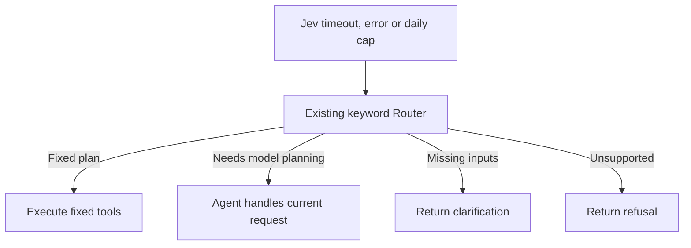

# V4: retain complete fixed plans before considering an agent

Enable explicitly with `AGENT_JEV_MODE=v4`. Production `decide` remains V3;
`router_gate` is retired from runtime configuration. Its payload and pure policy
are archived under `services/agent/eval/legacy_router_gate.py`; recorded captures
remain reproducible through the evaluator's `--replay` path only.
The previous offline `v4_scope_argmax` experiment is not this new mode.

## Request flow

1. Jev reads the query as typed intent, topic, dataset, measure and scope facts.
   Select each Choice's highest-probability option; binary facts use 0.5. No
   confidence gate is used, including downstream comparison/change handling.
2. Code binds explicit entities and calendar windows to fixed tool templates.
   The existing router plan can be reused when its result type agrees with Jev;
   a missed keyword does not itself require an agent. No free-form query
   rewriting, backend answer generation or new model fitting occurs here.
3. Validate the plan's argument schemas, measured dataset coverage, requested
   dataset definitions, and named entities. Unsupported/missing scope is
   clarified without dropping constraints. An exact point lookup needs no radius.
4. For a concrete candidate, a second Jev stage makes a binary `router`/`agent`
   completeness decision over the original query, exact calls, output selectors
   and tool contracts. Choose the highest-probability option without a confidence
   threshold. Formatting, normal comparison differences and view rendering are
   harness work, not reasons to invoke an agent.
5. Accepted calls run through the existing deterministic harness. No complete
   fixed template, or a rejected ordinary plan, goes to the agent with the typed
   intent and appropriate tool set. A rejected harness-only metrics/grid plan
   clarifies, because those tools are not in the agent's catalog.

The fixed compiler supports single-dataset counts/record lists, maps, time
charts, map-plus-chart, rankings, point/territory/circuit inspection, historical
risk, model metrics/grids, and single-metric comparisons across counties,
utilities or two periods. Endpoint months retain their full calendar bounds;
span totals remain one inclusive interval. Multi-dataset, dependent and custom
cross-result operations beyond these templates use the agent.

The initial three Jev payloads run concurrently at runtime; the plan check is
conditional and sequential. Daily-call reservations count three plus one when
needed. On timeout, backend failure, missing/invalid answers or daily cap, V4
restores the original keyword Router decision captured before Jev. Fixed plans
execute normally; a model route invokes the Agent; clarification/refusal returns
directly. Partial Jev intent/plan data is discarded. The slot planner
does not override V4. Forced-model and disabled-router evaluation switches
remain explicit evaluation overrides, not normal V4 operation.

Pre-Jev backstops, injection protection, cancellation/quota
accounting, and logging retention are still open review items. This document
describes the current draft implementation, not a completed production rollout.

## Jev fault fallback

The existing keyword/regex Router remains in `services/agent/routing.py` and
`AgentOrchestrator.ask()` runs it before Jev. V4 now reuses that decision on a
technical fault, rather than calling Jev again or accepting an unfinished V4
candidate. An original model route goes to the Agent with the normal tool
catalog and parameter grounding. Keyword clarifications/refusals are not
overridden by an Agent. A valid Jev decision to clarify, refuse or delegate is
not a technical fault and does not activate fallback.

Provenance is `source=router` with `jev_timeout`, `jev_error`, or `jev_daily_cap`.
The original decision is copied so a late worker cannot mutate the route being
used by its caller. Existing tool validation, measured coverage and caveat checks
still apply. This deliberately inherits the legacy Router's semantic limitations,
including known comparison/output omissions; it is not a new accuracy guarantee
for degraded operation. Late-call cancellation and reservation refunds remain
separate pending work.

The Agent has tool-result and retry context within one request, but no cross-query
chat history: `/ask` and `/ask/stream` receive only `question`, and the website
sends only the latest query. Model routing failure returns an error; synthesis
failure after successful tool reads can fall back to a deterministic evidence
summary. Agent timeout wording and multi-turn memory were not changed here.



The earlier interactive diagram under `docs/diagrams/jev-v4-workflow.*` is a
pre-fallback historical snapshot. Its new branching layout did not pass the
diagram validator; the original checked artifact was preserved. The flow above
and this document describe the current fault behavior.

`services/agent/decisions/v4_router.py` owns the typed schema, compiler and
shared live/replay policy (current schema `v4_router_v2`). It reuses the historical V4 structural
constraints without modifying their old request schemas. The new prompt
distinguishes circuit inventory from CPZ, point containment from proximity,
and a user's missing current location from requests for live wildfire data.

V2 uses one operation-specific missing-geographic-parameter question; the old
proximity fact is no longer asked or applied. Static inventory containment with
no point asks for a location even if the topic reading incorrectly says live
data. Composite on-topic measures across multiple datasets go to the agent
rather than the single-metric clarification. The V1 capture and its unchanged
labels remain available at the frozen V1 source revision for reproducibility.

## Evaluation contract

`services/agent/eval/v4_router_cases_v1.json` preserves the original 80 queries
and their disposition labels, adds explicit executor labels and reviewed tool
arguments/output selectors, and adds eight beyond-template agent controls.
There are 52 router-capable queries, 28 clarification/refusal queries, and eight
agent queries. The 43 previously demonstrated fixed-template questions are
reported separately from nine new fixed-template capabilities. The eight new
controls are development tests, not a blind holdout.

The primary score requires the right executor AND the complete expected plan.
An unnecessary agent handoff is wrong even if the final model might answer.
Returning a map while omitting a requested chart, dropping a filter, or using a
span total for a period comparison fails the plan check. Clarification wording
for missing current location must ask for location, not a calendar date.

Report router retention, unnecessary handoffs, erroneous plan acceptance,
agent handoff precision/recall, and clarify/refuse agreement separately. Agent
controls do not establish end-to-end answer correctness. All API calls in this
benchmark are Jev classification calls; no Luna or data-service execution.

Preview without network:

```powershell
python -m services.agent.eval.router_gate_compare --cases services/agent/eval/v4_router_cases_v1.json
```

Fresh paired V3/V4 run, five repeats with alternating version order:

```powershell
python -m services.agent.eval.router_gate_compare --cases services/agent/eval/v4_router_cases_v1.json --run --repeats 5 --cap-usd 1 --output services/agent/eval/runs/v4_router_review_20260929
```

Use a new output directory and the remaining authorized budget. The capture
stores exact initial and conditional requests, answers/probabilities, hashes,
and per-query plans. Offline replay reconstructs conditional plan checks and
requires complete case/mode/repeat coverage. Freeze code and labels before the
paid run; do not silently change either to improve the recorded score.
